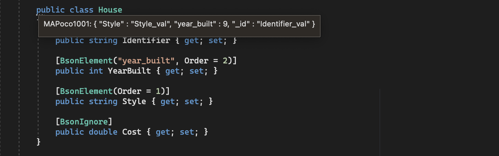
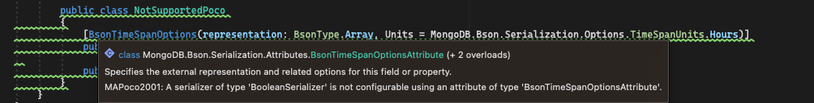

MongoDB C# Analyzer Sample
==========================

This sample demonstrates the usage of the MongoDB Roslyn Analyzer.
MongoDB.Analyzer allows you to preview, at compile time, the underlying MQL generated for LINQ and Builders queries, as well as the corresponding JSON for POCOs (Plain Old CLR/Class Objects).
It also provides early warnings for unsupported POCOs, LINQ and Builder expressions, and invalid queries.

Getting Started
---------------
* Open the `MongoDB.Analyzer.Samples.sln` solution in VS2019, VS2022, or Rider 2021.2 (and higher).
* Build the solution.
* For the initial run, allow a few minutes for Visual Studio to run the Analyzer.
* Inspect the warnings and informational messages in the output panel or the code browser.
* Edit LINQ and Builder expressions or POCOs and inspect the live updates.

After a successful installation, the Analyzer should appear under the `Dependencies/Analyzers` folder:

Inspecting the MQL and JSON
---------------------------
* Hover over the three grey dots under the LINQ or Builders expression or the POCO. An informational tooltip containing the corresponding MQL query or JSON will pop up.
* Unsupported LINQ or Builders expressions or POCOs will be highlighted in the IDE as warnings.

Samples
-------
* [Builders samples](BasicSample/BuildersSample.cs)
* [LINQ samples](BasicSample/LinqSample.cs)
* [POCO samples](BasicSample/PocoSample.cs)
* [EF samples](BasicSample/EFSample.cs)

Examples:
Builders filter expression:

LINQ expression:

LINQ expression:

POCO:

Builders unsupported expression:

LINQ unsupported expression:

POCO unsupported:

All Analyzer diagnostics in the output panel:

POCO to JSON Analysis Settings
------------------------------
Two settings are available within the Analyzer for POCO to JSON analysis. The first, `PocoAnalysisVerbosity`, sets the POCO analysis verbosity.
The default setting is `"Medium"`, which only provides diagnostics for POCOs with class-level BSON attributes, property/field-level BSON attributes, or if the POCO type has been used with a Builders/LINQ query.
The other settings are `"None"`, which processes no POCOs, or `"All"`, which processes all POCOs within the file. The second setting, `PocoLimit`, sets an upper limit on the number of POCOs to be analyzed. The default value of `PocoLimit` is 500.

To change the default POCO analysis verbosity, set either `"PocoAnalysisVerbosity": "None"` or `"PocoAnalysisVerbosity": "All"` in the `mongodb.analyzer.json` settings file.
To change the default Analyzer POCO processing limit, set `PocoLimit: limit`.

Not Supported
-------------
* Custom serializers are not supported in the current version. Therefore, the MQL generated at runtime could differ from the MQL presented by the Analyzer.

Troubleshooting
---------------
* Ensure that VS2019, VS2022, or Rider 2021.2 (and higher) have the most recent updates. Analysis for some expressions might not be supported in older VS2019 versions.
* LINQ or Builders expressions or POCOs for which MQL or JSON is not generated might not be supported in the current Analyzer version.
* Some expressions may not be analyzed due to internal Visual Studio errors. In such cases, set `"OutputInternalExceptions": "true"` in the `mongodb.analyzer.json` settings file. If the expression fails to be analyzed due to an internal error, the error will be reported as a warning. Please report this error along with the Visual Studio version and OS platform.
* For further troubleshooting, enable log output by setting `"OutputInternalLogsToFile": "true"` and `"LogFileName": "full_existing_path\\logs_filename"`.

Error example:

