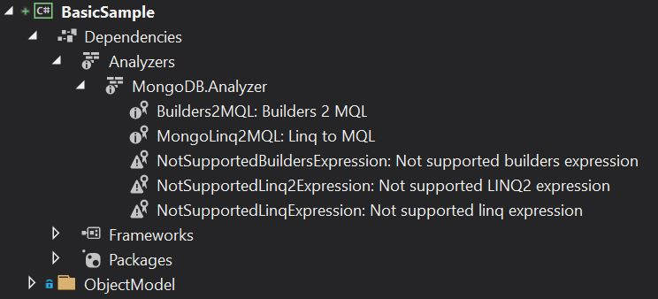
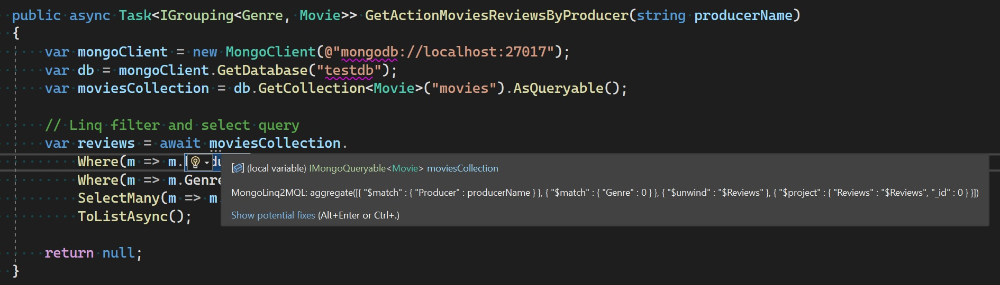
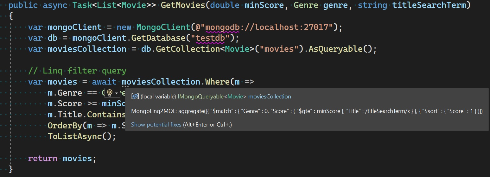
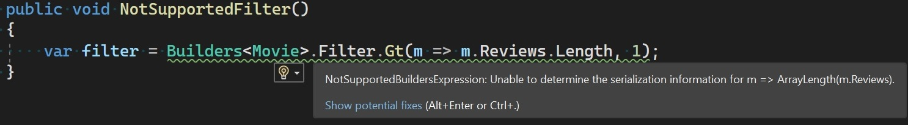
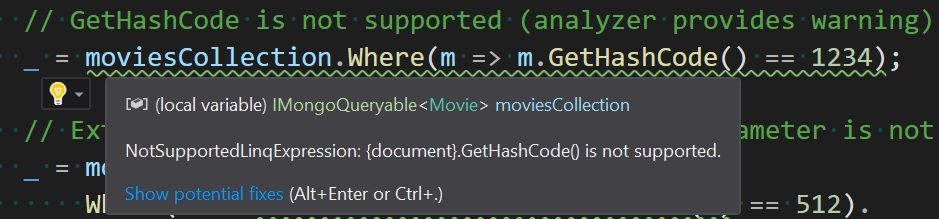
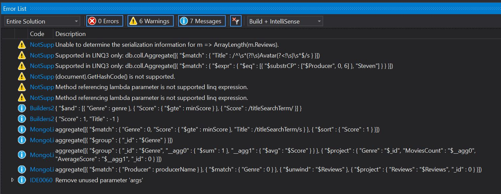
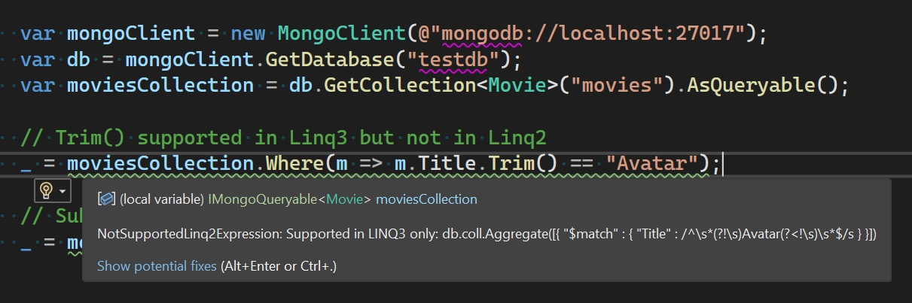
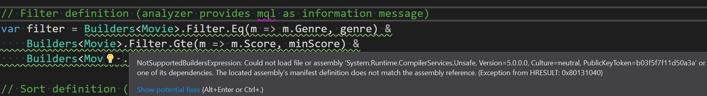

MongoDB C# Analyzer Sample
=================

This sample demonstrates the usage of MongoDB Roslyn analyzer. MongoDB.Analyzer allows to preview in compile time the underlying MQL, generated for LINQ and Builders queries. It also provides an early warning for unsupported expressions and invalid queries.

Getting Started
---------------
* Open MongoDB.Analyzer.Samples.sln solution in VS2019, VS2022 or Rider 2021.2 (and higher)
* Build the solution.
* For the initial run, allow a few minutes for VS to run the analyzer.
* Inspect the warnings and information messages in the output panel or in the code browser.
* Edit LINQ and Builder expressions and inspect the live updates.

After successful install, the analyzer should appear under Dependencies/Analyzers folder:


Inspecting the MQL
-----------------
* Hover over 3 grey dots under the LINQ or Builders expression. An information tooltip containing corresponding MQL query will pop up.
* Not supported LINQ or Builders expressions will be highlighted in IDE as a warning.

Samples
-------
* [Builders samples](BasicSample/BuildersSample.cs)
* [LINQ samples](BasicSample/LinqSample.cs)
* [LINQ3 samples](BasicSample/Linq3Sample.cs)

Examples:
Builders filter expression:


Linq expression:


Linq expression:


Builders unsupported expression:


Linq unsupported expression:


All Analyzer diagnostics in the output panel:



LINQ 3
------
MongoDB Driver 2.14 and higher, introduces new LINQ3 provider, while LINQ2 provider is still used by default. The analyzer will use the default LINQ provider (LINQ2).
For the expressions that are not supported in LINQ2 but are supported in LINQ3, appropritate warning will be generated containing LINQ3 MQL information.

LINQ3 only expresion:


To switch the default Analyzer LINQ provider to LINQ3, please set ```DefaultLinqVersion": "V3"``` in ```mongodb.analyzer.json``` settings file.

Not supported
-------------
* Custom serialization settings, including BSON attributes are not supported in the current version. Therefore the MQL generated in runtime could be differ from the MQL presented by the Analyzer.
* Builders projections are not supported.

Troubleshooting
--------------
* Please make sure that VS2019, VS2022, Rider 2021.2 (and higher) have the most recent updates. Analysis for some expressions might not be supported in older VS2019 versions.
* LINQ or Builders expressions for which MQL is not generated, might be not supported in the current Analyzer version.
* Some expressions are not being analyzed due to internal VS errors. In such cases please set ```"OutputInternalExceptions": "true"``` in ```mongodb.analyzer.json``` settings file. If the expression fails to be analyzed due to an internal error, the error will be reported as a warning. Please report this error, along with the VS version and OS platform.
* For further troubleshooting please enable the logs output by setting ```"OutputInternalLogsToFile": "true"``` and ```"LogFileName": "full_existing_path\\logs_filename"```.

Error example:

